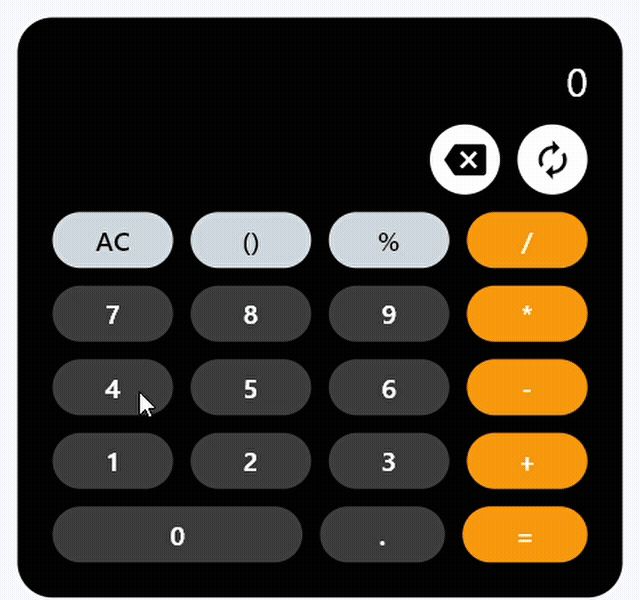
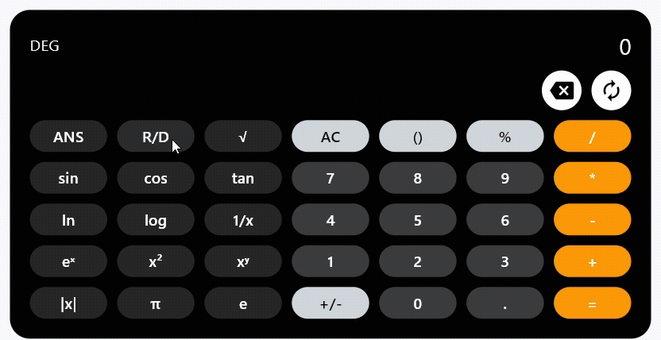
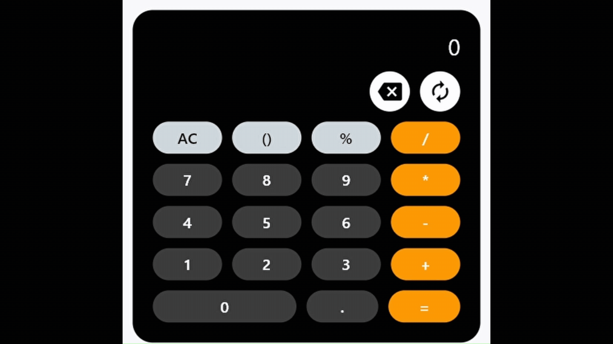
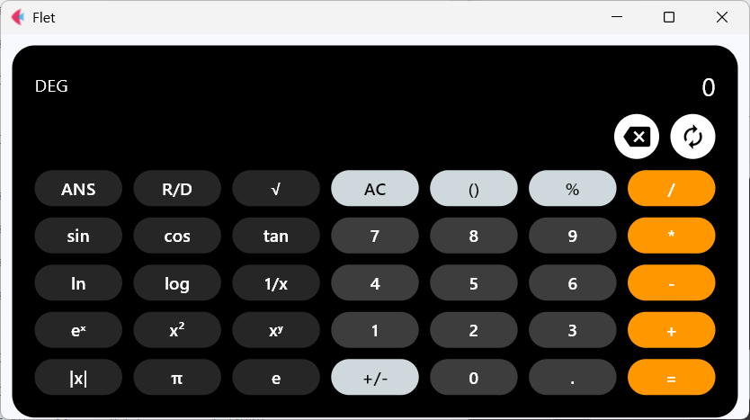

<h1 align="center">Flet 기반 공학용·사무용 전환형 계산기 구현</h1>

<p align="center">
  
  
</p>
<p align= "center">
   
</p>
                                  
## 🚀 Introduction
<p>


</p>

Python Flet을 활용해 구현한 공학용·사무용 전환형 GUI 계산기이다.<br>
하나의 프로그램 내에서 사무용 계산기와 공학용 계산기를 자유롭게 전환할 수 있도록 설계되었으며,<br>
직관적인 UI와 안정적인 수식 처리 로직을 기반으로 다양한 연산을 지원한다.  

## 🔑 Features

### 1️⃣ Standard Mode
<p>
  
</p>

- 기본 사칙연산($$+, −, ×, ÷$$) 및 소수점 연산 지원
- 괄호 연산 지원
- 퍼센트(%) 기능 제공
- 백스페이스 및 전체 초기화(AC) 지원

### 2️⃣ Engineering Mode
<p>
  
</p>


- 삼각함수: sin, cos, tan (DEG/RAD 지원)
- 로그함수: log, ln
- 지수함수: eˣ, xʸ
- 상수: π, e
- 부호 전환(±) 기능 제공
- 제곱, 루트, 절댓값 등 지원
- 이전 결과 재사용(ANS 기능)
  
### 3️⃣ Additional Features
- 공학용/사무용 전환 기능
- 자동 괄호 닫힘 처리
- 오류 발생 시 자동 초기화 처리

## ⚙️ How It Works
본 계산기는 문자열 기반 수식 처리 구조와 상태 관리 로직을 통해 동작한다.
- 사용자 입력 수식은 **표시용(expression)** 과 **계산용(eval_expression)** 으로 분리 관리된다.
- 계산은 제한된 환경에서 `eval()`로 수행되어 안정성과 보안을 확보하였다
```
expression = "3 + 4 * 2"
result = eval(expression)
print(result)  # 11
```
- 입력 흐름은 상태 변수(`current_input`, `just_calculated`, `open_parens`)를 통해 제어된다.
- 함수 입력 시 **자동 괄호 생성** 및 **자동 곱셈 처리** 로직이 적용된다.
- 사무용·공학용 계산기는 **독립 컴포넌트**로 구현되며 콜백 기반으로 전환된다. 

## 🚀 How to Run

1. 저장소 클론
```
git clone https://github.com/kimjihoon001/flet-practice.git
cd flet-practice
```
2. 가상환경 생성 및 활성화
```
python -m venv myvenv
myvenv\Scripts\activate    #window
```
3. 패키지 설치
```
pip install "flet>=0.81.0"
```
4. 실행
```
flet run
```
> flet 기능으로 자동으로 폴더 내부에 있는 `main.py`를 찾아 실행한다. 
